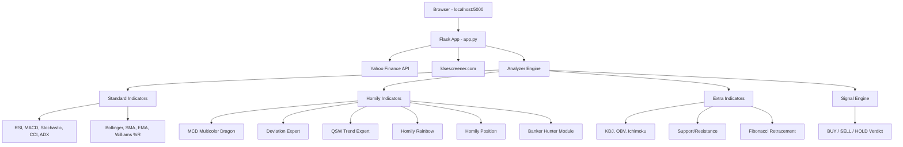
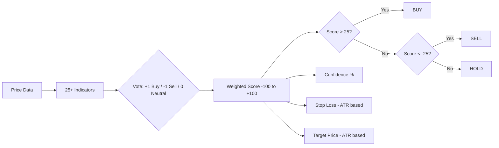
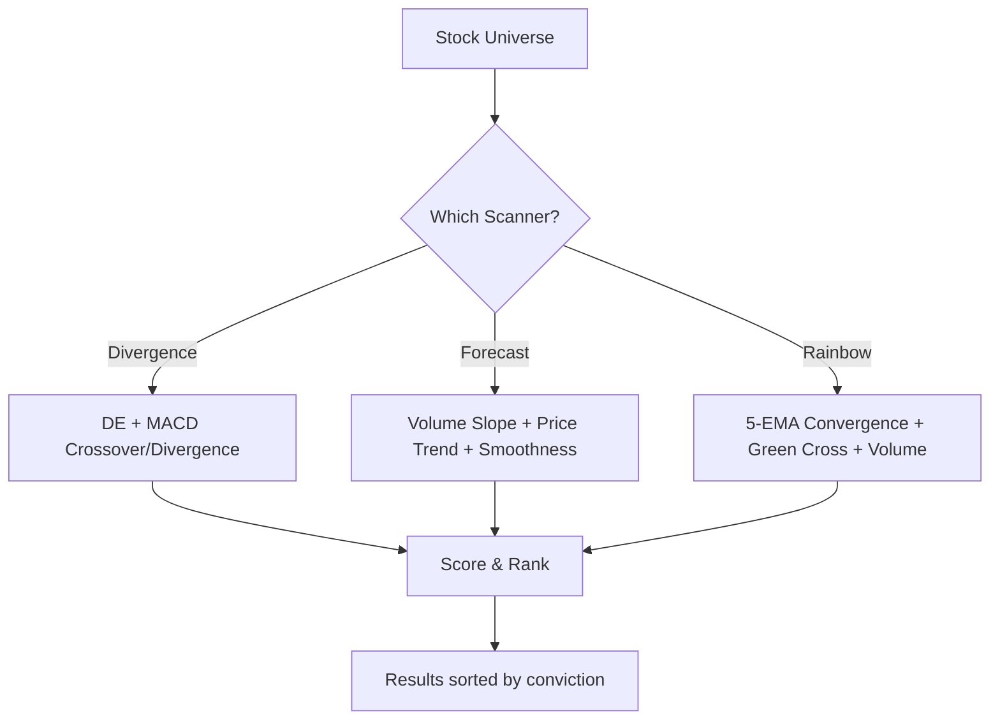

# KLSE Stock Analyzer

A comprehensive KLSE (Bursa Malaysia) stock analysis platform with 25+ technical indicators, multiple scanners, and an AI-powered Buy/Sell signal engine.

## Features

### Pages

| Page | URL | Description |
|------|-----|-------------|
| Top 50 Volume | `/` | Most active stocks (Daily/Weekly), from Yahoo Finance screener |
| Dashboard | `/dashboard` | Full market overview (pickastock style) |
| Stock Detail | `/stock/1023.KL` | Individual stock with all charts & signals |
| Divergence Scanner | `/divergence` | DE + MACD divergence detection |
| Accumulation Forecast | `/forecast` | Volume increasing + price uptrend scanner |
| Rainbow Crossover | `/rainbow` | Homily Rainbow EMA convergence scanner |

### Technical Indicators (25+)

**Standard Indicators:**
- RSI (14), MACD, Stochastic (14,3), Williams %R, CCI (20)
- ADX (14), Momentum (10), Awesome Oscillator, Ultimate Oscillator
- Bollinger Bands, SMA (20/50/200), EMA (12/26)

**Chinese/Asian Technical Analysis:**
- KDJ (随机指标) — K/D/J oscillator with overbought/oversold J line
- OBV (On-Balance Volume) — Cumulative volume flow
- Ichimoku Cloud (一目均衡表) — Tenkan/Kijun/Senkou Span

**Homily Chart Indicators (reconstructed):**
- MCD 六彩神龙 (Multicolor Dragon) — Chip distribution (FCHIPS/PCHIPS/LCHIPS)
- Deviation Expert (背离王) — EMA(5) - EMA(20) fund flow
- QSW 趋势王 (Trend Expert) — Volume-weighted EMA crossover
- Homily Rainbow 弘历彩虹 — 5-color EMA cascade (3/7/13/21/55)
- Homily Position 弘历进出 — VWMA life line + ATR resonance bands
- L3 Banker Fund — Slope-based institutional behavior model
- MCDX Smart Money — RSI-based stacked histogram

**Banker Hunter (庄家猎手) Module:**
- Banker Holding (庄家持仓) — Institutional holding % estimate
- Banker Control (庄家控盘) — Float control measurement
- Banker Cost Line (庄家成本线) — VWAP-based entry price
- Wash Out (洗盘) — Shakeout detection
- Profit Line (获利线) — Profitable position cost basis

**Chart Overlays:**
- Support & Resistance (auto-detected pivot levels)
- Fibonacci Retracement (23.6%, 38.2%, 50%, 61.8%, 78.6%)
- Parabolic SAR (Homily True Trend Circles — Red/Blue/Yellow)

### Signal Engine

Combines all indicators into a single **BUY / SELL / HOLD** verdict:
- Weighted scoring across all 25+ indicators
- Confidence % (indicator agreement level)
- Risk level (LOW/MEDIUM/HIGH based on volatility)
- Auto-calculated Stop Loss and Target Price (ATR-based)
- Risk:Reward ratio

### Scanners

**Divergence Scanner:**
- Detects DE bullish/bearish crossovers
- MACD golden/dead cross
- Price-indicator divergences (single and double confirmed)

**Accumulation Forecast:**
- Finds stocks with steadily increasing volume over 30 days
- Price quietly trending up (low volatility, smooth)
- Scores by: volume slope, price trend, smoothness, consistency

**Rainbow Crossover:**
- Detects Green EMA(13) crossing above Blue(21)/White(55) from below
- Checks for all 5 lines converging (breakout setup)
- Volume confirmation (increasing = institutional accumulation)

## Setup

### Requirements
- Python 3.12+
- pip

### Install & Run

```bash
cd klse
pip install -r requirements.txt
python app.py
```

Then open: **http://localhost:5000**

Or use the batch file (Windows):
```bash
start.bat
```

### Deploy to Render (free hosting)

1. Push to GitHub
2. Go to [render.com](https://render.com) → New Web Service
3. Connect your GitHub repo
4. Build Command: `pip install -r requirements.txt`
5. Start Command: `gunicorn app:app --bind 0.0.0.0:$PORT --timeout 120 --workers 2`

## Architecture



## Signal Flow



## Scanner Architecture



## Indicator Categories

```
┌─────────────────────────────────────────────────────────────────┐
│                    SIGNAL ENGINE (25+ indicators)                 │
├──────────────┬──────────────────┬──────────────┬────────────────┤
│  MOMENTUM    │  TREND           │  VOLUME      │  PROPRIETARY   │
├──────────────┼──────────────────┼──────────────┼────────────────┤
│ RSI (14)     │ MACD             │ OBV          │ MCD 六彩神龙    │
│ Stochastic   │ Parabolic SAR    │ MCDX Chips   │ DE 背离王      │
│ KDJ          │ ADX              │ Banker Hold  │ QSW 趋势王     │
│ Williams %R  │ Ichimoku Cloud   │ Banker Ctrl  │ Rainbow 弘历彩虹│
│ CCI          │ Homily Rainbow   │ Accumulation │ Position 弘历进出│
│ Momentum     │ Homily Position  │ Vol Growth   │ L3 Banker      │
│ AO / UO      │ Fibonacci        │ Wash Out     │ Profit Line    │
└──────────────┴──────────────────┴──────────────┴────────────────┘
                              │
                              ▼
              ┌───────────────────────────────┐
              │  VERDICT: BUY / SELL / HOLD    │
              │  Score: -100 to +100           │
              │  Confidence: 0-100%            │
              │  Stop Loss | Target | R:R      │
              └───────────────────────────────┘
```

## Data Sources

| Source | What it provides |
|--------|-----------------|
| Yahoo Finance (chart API) | OHLCV price data, all timeframes |
| Yahoo Finance (screener API) | Top volume / most active stocks |
| klsescreener.com | All Bursa stocks (Main/ACE/LEAP markets) |

## Project Structure

```
klse/
├── app.py                  # Flask web server + API routes
├── analyzer.py             # Core indicator calculations (25+)
├── homily_indicators.py    # Homily Chart reconstructed indicators
├── extra_indicators.py     # KDJ, OBV, Ichimoku, S/R, Fibonacci
├── yahoo_api.py            # Yahoo Finance API client
├── signal_engine.py        # Buy/Sell/Hold verdict engine
├── divergence_scanner.py   # DE + MACD divergence scanner
├── accumulation_scanner.py # Volume accumulation pattern scanner
├── rainbow_scanner.py      # Rainbow EMA crossover scanner
├── top_volume.py           # Top volume stock fetcher
├── klse_scraper.py         # klsescreener.com scraper
├── data_fetcher.py         # Legacy yfinance wrapper
├── visualizer.py           # Matplotlib chart generator
├── templates/
│   ├── index.html          # Top 50 volume page
│   ├── stock.html          # Individual stock analysis page
│   ├── dashboard.html      # Full market dashboard
│   ├── divergence.html     # Divergence scanner page
│   ├── forecast.html       # Accumulation forecast page
│   └── rainbow_scan.html   # Rainbow crossover scanner page
├── start.bat               # Windows quick-start script
├── requirements.txt        # Python dependencies
├── Procfile                # Render/Heroku deployment
├── render.yaml             # Render deployment config
└── runtime.txt             # Python version spec
```

## Timeframes

| Button | Period | Interval |
|--------|--------|----------|
| TIME | Today | 1-minute candles |
| DAILY | 6 months | Daily candles (default) |
| WEEKLY | 2 years | Weekly candles |
| MONTHLY | 5 years | Monthly candles |
| MIN | Today | 5-minute candles |
| F10 | 5 days | 15-minute candles |

## Disclaimer

This tool is for **educational and personal analysis purposes only**. It does not constitute financial advice. Always do your own research before making investment decisions. Past indicator performance does not guarantee future results.

## License

Private — Personal use only.
